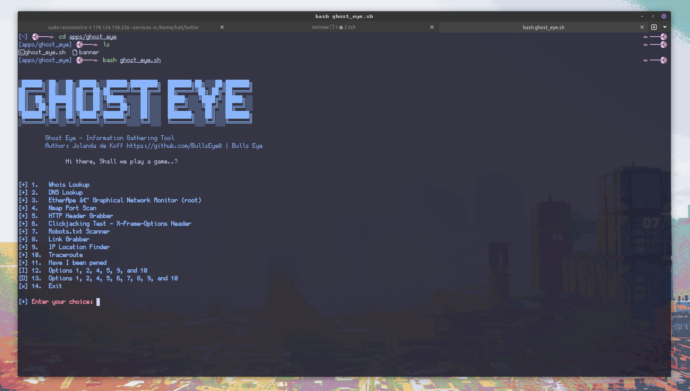

# Ghost Eye
Ghost Eye - Information Gathering Tool
<div>

**Ghost Eye** New Release. Ghost Eye is an Information Gathering, Footprinting, Scanner, and Recon Tool I made in Python 3. Since the last release of Ghost Eye, I've tweaked, removed, and added some new features. So that Ghost Eye would become more of a whole. For me, it remains a game of options so that together you get a complete overview of your target.

****
Here you can read an article i wrote about Ghost Eye

https://hackingpassion.com/ghost-eye-informationgathering-footprinting-and-reconnaissance-tool-release/

****


## Ghost Eye gathers information data such as:

Hi there, Shall we play a game..? 😃

[+] 1.   EtherApe – Graphical Network Monitor (root)

[+] 2.   DNS Lookup

[+] 3.   Whois Lookup

[+] 4.   Nmap Port Scan

[+] 5.   HTTP Header Grabber

[+] 6.   Clickjacking Test - X-Frame-Options Header

[+] 7.   Robots.txt Scanner

[+] 8.   Cloudflare Cookie scraper

[+] 9.   Link Grabber

[+] 10.  IP Location Finder

[+] 11.  Detecting CMS with Identified Technologies

[+] 12.  Traceroute

[+] 13.  Crawler target url + Robots.txt

[+] 14.  Certificate Transparency log monitor

[x] 15.  Exit

[+] Enter your choice:



  

## Install and run on Linux
 
You have to install Nmap and EtherApe too:
```sudo apt-get install etherape```
  
## Use:
```bash ghost_eye.sh```


